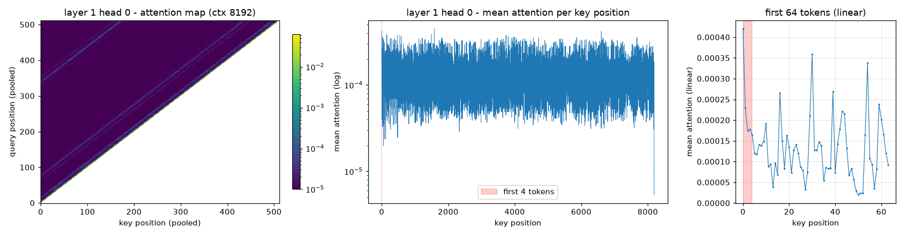
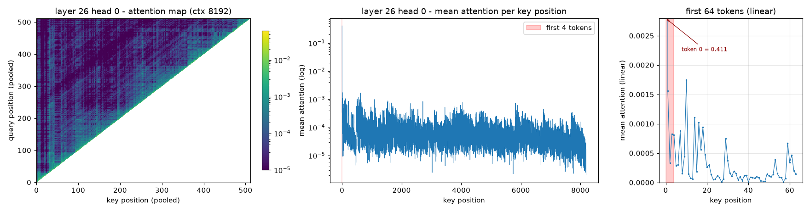

# 实验：Attention sink 可视化 + StreamingLLM 式 KV 策略验证

模型：Qwen2.5-1.5B-Instruct（bf16，eager attention；fp16 会因激活值上溢产生 NaN，故用 bf16）

长文本：LongBench narrativeqa 第一篇文档（202039 字符）

计算资源: RTX 4060 laptop 8GB

主体部分代码: scripts/

结果: results/

结果分析: report.md

复现过程中的经验: To be done

逐块 PPL 曲线
| chunk 起点 | full | window | sink_window |
|---|---|---|---|
| 0 | 6.02 | 6.02 | 6.02 |
| 1024 | 4.32 | 4.32 | 4.32 |
| 2048 | 5.78 | **16.33** | 5.88 |
| 4096 | 5.21 | **13.48** | 5.47 |
| 8192 | 4.77 | **11.38** | 5.34 |
| 11264 | 5.43 | **9.94** | 6.13 |

可视化：（ctx8192下）
第1层的注意力图

第26层的注意力图
